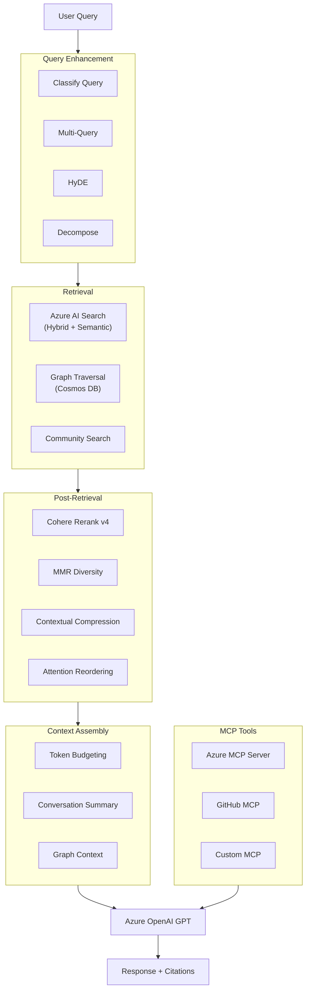

# PRD: Advanced RAG Features for SimpleChat

**Version:** 1.0
**Author:** Claude (AI-assisted)
**Date:** 2026-03-25
**Status:** Draft
**Project:** SimpleChat v0.239.002+
**Archon Project ID:** 0ff42a4e-466c-499f-92e9-c78686d82785

---

## 1. Executive Summary

This PRD defines five major feature areas that transform SimpleChat from a document-upload RAG application into a comprehensive knowledge intelligence platform. Each feature builds on the existing Azure-native architecture (Cosmos DB, AI Search, Azure OpenAI, Semantic Kernel) and is designed as an admin-configurable toggle that can be enabled independently.

| Feature | What It Does | Business Value |
|---------|-------------|----------------|
| **Web & GitHub Crawling** | Ingest content from URLs, websites, sitemaps, and GitHub repos into RAG workspaces | Eliminates manual download-upload friction; enables live knowledge bases |
| **Advanced Search Quality** | Reranking, query expansion, HyDE, MMR diversity, context compression | 20-35% accuracy improvement; fewer hallucinations; better answers |
| **MCP Client Support** | Connect to external tool servers via Model Context Protocol | Agents can query databases, call APIs, search the web — unlimited extensibility |
| **Graph RAG** | Extract entities and relationships to build a knowledge graph | Multi-hop reasoning; "how are X and Y related?"; thematic summarization |
| **Context Optimization** | Conversation summarization, token budgeting, lost-in-the-middle mitigation | Longer conversations without quality degradation; reduced token costs |

**Estimated Total Effort:** 12-16 weeks across all features (can be parallelized)
**New Azure Resources Required:** Cohere Rerank v4 deployment (Azure AI Foundry) — all other features use existing services

---

## 2. Table of Contents

- [1. Executive Summary](#1-executive-summary)
- [2. Table of Contents](#2-table-of-contents)
- [3. Background & Motivation](#3-background--motivation)
- [4. Feature 1: Web & GitHub Crawling](#4-feature-1-web--github-crawling)
- [5. Feature 2: Advanced Search Quality](#5-feature-2-advanced-search-quality)
- [6. Feature 3: MCP Client Support](#6-feature-3-mcp-client-support)
- [7. Feature 4: Graph RAG](#7-feature-4-graph-rag)
- [8. Feature 5: Context Optimization](#8-feature-5-context-optimization)
- [9. Architecture Overview](#9-architecture-overview)
- [10. New Dependencies](#10-new-dependencies)
- [11. New Files](#11-new-files)
- [12. Modified Files](#12-modified-files)
- [13. Admin Settings](#13-admin-settings)
- [14. Database Schema Changes](#14-database-schema-changes)
- [15. Phased Implementation Plan](#15-phased-implementation-plan)
- [16. Cost Analysis](#16-cost-analysis)
- [17. Risk Assessment](#17-risk-assessment)
- [18. Success Metrics](#18-success-metrics)
- [19. Open Questions](#19-open-questions)

---

## 3. Background & Motivation

### Current State

SimpleChat is a production-ready Azure-native RAG application with:
- File-upload-only document ingestion (PDF, DOCX, images, audio, video)
- Hybrid search (vector + keyword) via Azure AI Search with semantic ranking
- Azure OpenAI GPT for chat completion with citation extraction
- Semantic Kernel agents with OpenAPI/native plugins
- Multi-workspace isolation (personal, group, public)
- 20+ admin-configurable optional features

### Gaps Identified

1. **No web content ingestion** — users must manually download and upload files
2. **Basic search pipeline** — no reranking, no query expansion, no diversity filtering
3. **No external tool integration** — agents limited to built-in plugins
4. **No relationship reasoning** — cannot answer "how are X and Y connected?"
5. **No context management** — long conversations degrade quality and waste tokens

### Target Users

- **Knowledge workers** who need to build RAG knowledge bases from web documentation, GitHub repos, and internal wikis
- **Analysts** who ask complex multi-hop questions across document collections
- **Teams** that need AI agents connected to external tools (databases, APIs, CRMs)

---

## 4. Feature 1: Web & GitHub Crawling

### 4.1 Overview

Enable users to add web content to their RAG workspaces by pasting URLs, crawling websites via sitemaps, or importing GitHub repositories. Crawled content flows through the existing chunking, embedding, and indexing pipeline.

### 4.2 User Stories

| ID | Story | Priority |
|----|-------|----------|
| WC-1 | As a user, I can paste a URL and have its content added to my workspace as a searchable document | P0 |
| WC-2 | As a user, I can provide a sitemap URL to crawl an entire documentation site into my workspace | P1 |
| WC-3 | As a user, I can provide a GitHub repo URL to import its README, docs, and code files | P1 |
| WC-4 | As an admin, I can configure crawl depth limits, page limits, and allowed domains | P1 |
| WC-5 | As a user, I can see crawl progress and status for each URL/site being processed | P1 |
| WC-6 | As a user, I can re-crawl a previously imported URL to update its content | P2 |
| WC-7 | As an admin, I can schedule recurring crawls for specific URLs/sitemaps | P2 |

### 4.3 Technical Design

#### Crawling Engine Stack

| Component | Library | Purpose | Status in SimpleChat |
|-----------|---------|---------|---------------------|
| **Primary crawler** | Crawl4AI (`crawl4ai>=0.8.0`) | JavaScript-rendered pages, markdown output | New dependency |
| **Content extractor** | Trafilatura (`trafilatura>=2.0.0`) | Static pages, superior metadata extraction | New dependency |
| **Fallback extractor** | BeautifulSoup + html2text | Simple pages, lightweight | Already installed |
| **Sitemap parser** | ultimate-sitemap-parser (`>=1.5.0`) | URL discovery from sitemaps | New dependency |
| **GitHub API** | PyGithub (`>=2.0.0`) | Repository content extraction | New dependency |
| **Deduplication** | simhash (`>=2.1.0`) | Near-duplicate page detection | New dependency |

#### Processing Pipeline

```
[URL Input]
    |
    +---> Single URL ---------> Trafilatura/BS4 extract
    +---> Sitemap URL --------> Parse sitemap -> URL queue
    +---> GitHub Repo URL ----> GitHub API -> file list -> URL queue
    |
    v
[URL Queue] (in-process for small jobs, Azure Queue Storage for large)
    |
    v
[Crawl Worker] (flask-executor background task, max 30 workers already configured)
    |
    +---> robots.txt check
    +---> Rate limiting (1.5-3.5s delay between requests)
    +---> Content extraction (Crawl4AI for JS, Trafilatura for static)
    +---> Deduplication check (SimHash fingerprint)
    |
    v
[Content Processing]
    |
    +---> HTML -> Markdown conversion
    +---> Metadata extraction (title, author, date, description, OG tags)
    +---> Source URL preservation for citations
    |
    v
[Existing SimpleChat Pipeline]
    |
    +---> MarkdownHeaderTextSplitter -> RecursiveCharacterTextSplitter
    +---> generate_embedding() (Azure OpenAI)
    +---> save_chunks() -> Azure AI Search
    +---> create_document() -> Cosmos DB (source_type="web" | "github")
```

#### New API Endpoints

```python
# Single URL ingestion
POST /api/workspace/documents/url
Body: { "url": "https://...", "workspace_id": "..." }

# Sitemap crawl
POST /api/workspace/documents/crawl
Body: { "sitemap_url": "https://.../sitemap.xml", "max_depth": 2, "max_pages": 100 }

# GitHub repo import
POST /api/workspace/documents/github
Body: { "repo_url": "https://github.com/org/repo", "branch": "main", "include_code": true }

# Crawl status
GET /api/workspace/documents/crawl/status/{job_id}

# Re-crawl
POST /api/workspace/documents/url/{document_id}/recrawl
```

#### Search Index Schema Additions

| Field | Type | Purpose |
|-------|------|---------|
| `source_url` | `Edm.String` | Original URL of crawled content |
| `source_type` | `Edm.String` | `"file"`, `"web"`, `"github"` |
| `content_hash` | `Edm.String` | SHA-256 for change detection |
| `last_crawled` | `Edm.DateTimeOffset` | Timestamp of last crawl |

#### Chunking Strategy for Web Content

1. **MarkdownHeaderTextSplitter** on headers (H1, H2, H3) for semantic boundaries
2. **RecursiveCharacterTextSplitter** for large sections (chunk_size=2000, overlap=200)
3. Preserve `source_url` in chunk metadata for citation linking

#### GitHub-Specific Handling

| File Type | Processing |
|-----------|-----------|
| `.md`, `.rst`, `.txt` | MarkdownHeaderTextSplitter → RecursiveCharacterTextSplitter |
| `.py`, `.js`, `.ts`, etc. | Language-aware splitting via `RecursiveCharacterTextSplitter.from_language()` |
| Binary files, lock files, `node_modules/` | Skip |
| Files > 100KB | Skip or truncate with warning |

### 4.4 UI Changes

1. **Workspace document upload area**: Add "Import from URL" tab alongside file upload
2. **URL input form**: Text field for URL, dropdown for type (Single Page / Sitemap / GitHub)
3. **Crawl options**: Max depth, max pages, include code files (for GitHub)
4. **Progress indicator**: Real-time status updates via polling or SSE
5. **Document list**: Show source_type icon (globe for web, GitHub logo for repos, file icon for uploads)
6. **Re-crawl button**: On web-sourced documents, show a refresh button

---

## 5. Feature 2: Advanced Search Quality

### 5.1 Overview

Enhance the search pipeline with post-retrieval reranking, query expansion, result diversity, and context assembly optimization. Each enhancement is independently toggleable.

### 5.2 User Stories

| ID | Story | Priority |
|----|-------|----------|
| SQ-1 | As a user, my search results are reranked by a cross-encoder for better relevance | P0 |
| SQ-2 | As a user, the system generates query variations to find more relevant documents | P1 |
| SQ-3 | As a user, search results include diverse documents, not just variations of the same chunk | P1 |
| SQ-4 | As a user, retrieved context is compressed to include only relevant sentences | P1 |
| SQ-5 | As an admin, I can configure reranking, query expansion, and context optimization | P0 |
| SQ-6 | As an admin, I can view retrieval quality metrics to evaluate improvements | P2 |

### 5.3 Technical Design

#### Enhanced Search Pipeline

```
User Query
    |
    v
[Query Enhancement Layer] (NEW)
    |-- classify_query() -> simple | complex | relationship
    |-- multi_query_retrieval() -> generate 3 query variations (if enabled)
    |-- hyde_search() -> generate hypothetical document embedding (if enabled)
    |-- query_decomposition() -> break complex queries into sub-queries (if enabled)
    |
    v
[Retrieval Layer] (EXISTING - functions_search.py)
    |-- Azure AI Search (BM25 + Vector + RRF)
    |-- Semantic Ranking (L2, top 50) -- ALREADY ENABLED
    |-- Cross-index score normalization -- ALREADY EXISTS
    |-- Search result caching -- ALREADY EXISTS
    |
    v
[Post-Retrieval Enhancement Layer] (NEW)
    |-- cohere_rerank() -> Cohere Rerank v4 on Azure AI Foundry (if enabled)
    |-- mmr_diversity() -> Maximal Marginal Relevance filtering (if enabled)
    |-- expand_parent_chunks() -> retrieve adjacent chunks for context (if enabled)
    |-- compress_chunks() -> extract only relevant sentences (if enabled)
    |-- reorder_for_attention() -> lost-in-the-middle mitigation (if enabled)
    |
    v
[Context Assembly Layer] (ENHANCED)
    |-- count_tokens() via tiktoken
    |-- budget_allocation() -> 50% search, 35% recent history, 15% summary
    |-- summarize_older_history() -> progressive conversation summarization
    |
    v
[Generation Layer] (EXISTING)
    |-- Azure OpenAI chat completion
```

#### Reranking: Cohere Rerank v4 on Azure AI Foundry

**Deployment**: Deploy `Cohere-rerank-v4.0-fast` as a serverless endpoint in Azure AI Foundry.

```python
# functions_reranking.py

import cohere

def rerank_with_cohere(query: str, documents: list, settings: dict, top_n: int = 10) -> list:
    """Rerank search results using Cohere Rerank v4 on Azure AI Foundry."""
    client = cohere.ClientV2(
        api_key=settings.get("cohere_rerank_api_key"),
        base_url=settings.get("cohere_rerank_endpoint"),
    )

    doc_texts = [doc["chunk_text"] for doc in documents]

    results = client.rerank(
        model="model",
        documents=doc_texts,
        query=query,
        top_n=top_n,
    )

    reranked = []
    for result in results.results:
        doc = documents[result.index].copy()
        doc["rerank_score"] = result.relevance_score
        reranked.append(doc)

    return reranked
```

**Performance**: +20-35% accuracy, +200-500ms latency per query for 30-50 documents.

#### Query Expansion: HyDE (Hypothetical Document Embeddings)

```python
# functions_query_expansion.py

def hyde_generate(query: str, gpt_client, gpt_model: str) -> str:
    """Generate a hypothetical answer document for embedding."""
    response = gpt_client.chat.completions.create(
        model=gpt_model,
        messages=[{
            "role": "user",
            "content": f"Write a detailed paragraph that would perfectly answer "
                       f"this question, as if from an expert document:\n\n{query}"
        }],
        max_tokens=200,
        temperature=0.7,
    )
    return response.choices[0].message.content.strip()
```

#### Multi-Query Retrieval

```python
def generate_query_variations(query: str, gpt_client, gpt_model: str, n: int = 3) -> list:
    """Generate N query variations for broader retrieval."""
    response = gpt_client.chat.completions.create(
        model=gpt_model,
        messages=[{
            "role": "user",
            "content": f"Generate {n} different versions of this question, each "
                       f"approaching it from a different angle:\n\n{query}\n\n"
                       f"Return only the questions, one per line."
        }],
        max_tokens=200,
        temperature=0.7,
    )
    queries = [query]
    for line in response.choices[0].message.content.strip().split("\n"):
        cleaned = line.strip().lstrip("0123456789.)- ")
        if cleaned:
            queries.append(cleaned)
    return queries[:n + 1]
```

#### MMR (Maximal Marginal Relevance) for Diversity

```python
def mmr_filter(query_embedding: list, documents: list,
               lambda_param: float = 0.7, k: int = 10) -> list:
    """Select diverse documents using Maximal Marginal Relevance."""
    # Requires document embeddings in results
    # lambda=0.7 = 70% relevance, 30% diversity
    # Implementation uses cosine similarity between document embeddings
    ...
```

> [!NOTE]
> MMR requires document embeddings in search results. Add `"embedding"` to the Azure AI Search `select` parameter when MMR is enabled.

#### Lost-in-the-Middle Reordering

```python
def reorder_for_attention(documents: list) -> list:
    """Place highest-relevance docs at start and end of context."""
    # LLMs attend most to beginning and end, ignoring the middle
    top_half = documents[::2]
    bottom_half = documents[1::2]
    return top_half + list(reversed(bottom_half))
```

#### Retrieval Metrics Logging

| Metric | What It Measures |
|--------|-----------------|
| `recall@K` | Fraction of relevant docs in top K |
| `MRR` | Position of first relevant result |
| `rerank_displacement` | Average position change after reranking |
| `source_diversity` | Unique documents/sources in results |
| `token_usage` | Tokens consumed per query (search context) |

### 5.4 Existing Code to Capture

The current `extract_search_results()` in `functions_search.py` does NOT capture:
- `@search.rerankerScore` (semantic ranker score, 0-4 range)
- `@search.captions` (extracted captions)

**Quick win**: Add these fields to enable better downstream decisions.

---

## 6. Feature 3: MCP Client Support

### 6.1 Overview

Enable SimpleChat's Semantic Kernel agents to connect to external MCP (Model Context Protocol) servers, exposing external tools (databases, APIs, file systems, web search) to the AI during chat.

### 6.2 Key Finding

**Semantic Kernel already has native MCP support** (since v1.28.1). SimpleChat uses `semantic-kernel>=1.39.4`, so the only change needed is adding the `[mcp]` extra to the pip install. MCP tools automatically appear alongside existing SK plugins via `FunctionChoiceBehavior.Auto`.

### 6.3 User Stories

| ID | Story | Priority |
|----|-------|----------|
| MCP-1 | As an admin, I can add an MCP server URL as a new action type alongside OpenAPI plugins | P0 |
| MCP-2 | As an agent user, MCP tools are automatically available during chat when the agent has MCP actions | P0 |
| MCP-3 | As an admin, I can test MCP server connectivity and view available tools before saving | P1 |
| MCP-4 | As an admin, I can restrict which MCP tools an agent can use (tool allowlist) | P1 |
| MCP-5 | As an admin, I can configure authentication for MCP servers (API key, OAuth, Azure Identity) | P1 |
| MCP-6 | As a user, MCP tool invocations appear in the citation/activity log | P2 |

### 6.4 Technical Design

#### Integration Architecture

```
Admin Settings (Cosmos DB)
    +-- Actions (plugin manifests)
         +-- type: "openapi"     -> OpenApiPluginFactory (existing)
         +-- type: "mcp_server"  -> MCPPluginFactory (NEW)
              +-- transport: "streamable_http" -> MCPStreamableHttpPlugin
              +-- transport: "sse"             -> MCPSsePlugin
```

#### MCP Action Manifest Schema

```json
{
    "name": "cosmos-db-tools",
    "type": "mcp_server",
    "description": "Azure Cosmos DB operations via MCP",
    "mcp_transport": "streamable_http",
    "mcp_url": "https://my-mcp-server.azurecontainerapps.io/mcp",
    "mcp_auth_type": "api_key",
    "mcp_auth_header": "Authorization",
    "mcp_auth_value": "Bearer <token>",
    "mcp_load_prompts": false,
    "mcp_timeout": 30,
    "mcp_allowed_tools": []
}
```

#### SK Integration Code

```python
# semantic_kernel_plugins/mcp_plugin_factory.py

from semantic_kernel.connectors.mcp import MCPStreamableHttpPlugin, MCPSsePlugin

async def create_mcp_plugin(manifest: dict):
    """Create an MCP plugin from an action manifest."""
    transport = manifest.get("mcp_transport", "streamable_http")

    PluginClass = (MCPStreamableHttpPlugin if transport == "streamable_http"
                   else MCPSsePlugin)

    plugin = PluginClass(
        name=manifest["name"],
        description=manifest.get("description", ""),
        url=manifest["mcp_url"],
        load_tools=True,
        load_prompts=manifest.get("mcp_load_prompts", False),
        request_timeout=manifest.get("mcp_timeout", 30),
    )

    await plugin.connect()
    return plugin
```

#### Connection Lifecycle

- **Per-request connections**: Connect at start of chat request, close at end
- MCP Streamable HTTP is lightweight (single HTTP endpoint)
- Future optimization: connection pool keyed by `(mcp_url, auth_token)` with TTL

#### Relevant MCP Servers for SimpleChat

| Server | Purpose | Source |
|--------|---------|--------|
| **Azure MCP Server** | 40+ Azure services (Cosmos DB, Storage, Key Vault, Monitor) | Microsoft official |
| **Cosmos DB MCP Toolkit** | Dedicated Cosmos DB operations with Entra ID auth | Microsoft/AzureCosmosDB |
| **GitHub MCP Server** | Full GitHub API (repos, issues, PRs, code search) | GitHub official |
| **Fetch MCP Server** | Web content fetching and markdown conversion | MCP reference servers |
| **Brave Search** | Web search capabilities | Community |
| **Firecrawl** | URL-to-markdown web crawling | Community |

#### Security Requirements

- Validate MCP server URLs against admin-configured allowlist
- Block connections to private IP ranges (SSRF prevention)
- Enforce HTTPS for all production MCP server URLs
- Per-tool permissions (admin can allowlist specific tools)
- Audit logging for all MCP tool invocations via existing `plugin_invocation_logger`

### 6.5 Dependency Change

```diff
# requirements.txt
- semantic-kernel>=1.39.4
+ semantic-kernel[mcp]>=1.39.4
```

This single change installs the MCP SDK as a dependency.

---

## 7. Feature 4: Graph RAG

### 7.1 Overview

Build a knowledge graph from uploaded documents by extracting entities and relationships using Azure OpenAI GPT. The graph enables multi-hop reasoning, relationship discovery, and thematic summarization that pure vector search cannot achieve.

### 7.2 User Stories

| ID | Story | Priority |
|----|-------|----------|
| GR-1 | As a user, I can ask "How are X and Y related?" and get answers using graph traversal | P0 |
| GR-2 | As a user, uploaded documents automatically have entities/relationships extracted | P0 |
| GR-3 | As an admin, I can enable/disable Graph RAG and configure entity types | P0 |
| GR-4 | As a user, I can see a list of extracted entities for each document | P1 |
| GR-5 | As a user, graph context appears alongside vector search results in chat | P1 |
| GR-6 | As a user, I can ask thematic questions ("What are the main topics?") using community summaries | P2 |
| GR-7 | As a user, I can view a visual graph of entities and relationships | P2 |

### 7.3 Technical Design

#### Storage: Cosmos DB NoSQL (Existing Account)

Three new containers in the existing `SimpleChat` database:

| Container | Partition Key | Purpose |
|-----------|--------------|---------|
| `graph_entities` | `/workspace_id` | Entity documents with embeddings |
| `graph_relationships` | `/workspace_id` | Relationship documents |
| `graph_communities` | `/workspace_id` | Community summaries |

#### Entity Document Schema

```json
{
    "id": "entity_abc123",
    "type": "graph_entity",
    "entity_type": "person",
    "entity_name": "John Smith",
    "entity_name_normalized": "john_smith",
    "description": "CFO mentioned in Q3 financial report",
    "source_document_ids": ["doc_001", "doc_002"],
    "source_chunk_ids": ["doc_001_3", "doc_002_7"],
    "workspace_type": "user",
    "workspace_id": "user_xyz",
    "embedding": [0.012, -0.034, ...],
    "community_id": "comm_42",
    "properties": { "role": "CFO", "organization": "Contoso" },
    "created_at": "2026-03-25T10:00:00Z"
}
```

#### Relationship Document Schema

```json
{
    "id": "rel_def456",
    "type": "graph_relationship",
    "relationship_type": "WORKS_AT",
    "source_entity_id": "entity_abc123",
    "target_entity_id": "entity_ghi789",
    "description": "John Smith works at Contoso as CFO",
    "weight": 0.95,
    "source_document_ids": ["doc_001"],
    "workspace_type": "user",
    "workspace_id": "user_xyz"
}
```

#### Entity Extraction Pipeline

```
Document Upload -> Existing Chunking Pipeline
    |
    v (parallel, non-blocking)
[Entity Extraction] (GPT-4o or GPT-4o-mini, JSON mode)
    |
    +---> For each chunk:
    |       1. Extract entities (name, type, description)
    |       2. Extract relationships (source, target, type, description)
    |       3. Resolve entities against existing graph (exact match + semantic similarity)
    |       4. Store new entities/relationships in Cosmos DB
    |       5. Update existing entities with new source references
    |
    v (optional, batch)
[Community Detection] (networkx + graspologic Leiden algorithm)
    |
    +---> Partition graph into communities
    +---> Generate LLM summaries per community
    +---> Store in graph_communities container
```

#### Entity Extraction Prompt

```
System: You are an expert at extracting structured knowledge from text.
Given a text passage, extract all entities and relationships.

For each ENTITY: entity_name, entity_type (person/organization/location/
concept/technology/document/event), description

For each RELATIONSHIP: source, target, relationship_type (WORKS_AT/
MENTIONS/REPORTS_TO/USES/DEPENDS_ON/LOCATED_IN/etc.), description

Return JSON: {"entities": [...], "relationships": [...]}
```

#### Entity Resolution

Two-stage deduplication:
1. **Exact match**: Normalize names (lowercase, remove titles, underscores for spaces)
2. **Semantic match**: If entity type matches and embedding cosine similarity > 0.85, merge

#### Graph-Enhanced Retrieval

```python
def graph_enhanced_search(query, vector_results, workspace_id, settings):
    """Augment vector search results with graph context."""

    # 1. Detect entities mentioned in query
    query_entities = detect_query_entities(query, workspace_id)

    # 2. Get graph neighborhood (1-2 hops)
    graph_context = []
    for entity in query_entities[:5]:
        neighbors, relationships = get_entity_neighborhood(
            entity["id"], workspace_id, depth=settings.get("graph_rag_max_depth", 2)
        )
        graph_context.extend(format_graph_context(entity, neighbors, relationships))

    # 3. Get relevant community summaries
    community_ids = set(e.get("community_id") for e in query_entities if e.get("community_id"))
    for comm_id in list(community_ids)[:3]:
        summary = get_community_summary(comm_id, workspace_id)
        if summary:
            graph_context.append(f"Topic Cluster: {summary['title']}\n{summary['summary']}")

    # 4. Inject graph context into LLM prompt
    return vector_results, "\n\n---\n\n".join(graph_context)
```

#### Query Routing

```python
def route_query(query, settings):
    """Route to appropriate retrieval method."""
    relationship_patterns = [
        r"how are .* related", r"connection between", r"depends on",
        r"what are all", r"who works", r"compare", r"summarize all",
        r"overview of", r"themes in", r"difference between"
    ]

    is_graph_query = any(re.search(p, query, re.IGNORECASE) for p in relationship_patterns)
    detected_entities = detect_entities_in_query(query, workspace_id)

    if is_graph_query and detected_entities:
        return "graph_first"       # Graph traversal + vector search
    elif is_graph_query:
        return "community_search"  # Search community summaries
    else:
        return "vector_only"       # Standard hybrid search
```

### 7.4 Cost Per Document

| Component | GPT-4o | GPT-4o-mini |
|-----------|--------|-------------|
| Entity extraction (10 chunks) | ~$0.03-0.10 | ~$0.003-0.01 |
| Entity embeddings (~20 entities) | ~$0.001 | ~$0.001 |
| Cosmos DB writes | ~$0.001 | ~$0.001 |
| **Total per document** | **~$0.03-0.10** | **~$0.005-0.01** |

---

## 8. Feature 5: Context Optimization

### 8.1 Overview

Manage conversation context intelligently with token budgeting, progressive summarization, and attention-optimized ordering. Prevents quality degradation in long conversations and reduces token costs.

### 8.2 User Stories

| ID | Story | Priority |
|----|-------|----------|
| CO-1 | As a user, long conversations maintain quality without hitting token limits | P0 |
| CO-2 | As a user, older conversation turns are automatically summarized to free up context space | P0 |
| CO-3 | As an admin, I can configure token budget allocation between search results and conversation history | P1 |
| CO-4 | As a user, my most recent messages and most relevant search results always get full context | P1 |

### 8.3 Technical Design

#### Token Budget Manager

```python
# functions_context_optimization.py

import tiktoken

def build_optimized_context(
    system_prompt: str,
    conversation_history: list,
    search_results: list,
    user_message: str,
    max_context_tokens: int = 12000,
    model: str = "gpt-4o",
) -> dict:
    """Assemble context within token budget with priority allocation."""

    system_tokens = count_tokens(system_prompt, model)
    user_tokens = count_tokens(user_message, model)
    response_reserve = 2000

    available = max_context_tokens - system_tokens - user_tokens - response_reserve

    # Budget: 50% search, 35% recent history, 15% older history summary
    search_budget = int(available * 0.50)
    recent_budget = int(available * 0.35)
    summary_budget = int(available * 0.15)

    # 1. Fit search results (highest priority)
    search_context = fit_within_budget(search_results, search_budget, model)

    # 2. Sliding window for recent messages
    recent_msgs = sliding_window(conversation_history, recent_budget, model)

    # 3. Summarize older messages
    older_msgs = conversation_history[:len(conversation_history) - len(recent_msgs)]
    summary = summarize_conversation(older_msgs, summary_budget, model) if older_msgs else None

    return {
        "summary": summary,
        "recent_messages": recent_msgs,
        "search_context": search_context,
        "token_breakdown": {...}
    }
```

#### Progressive Conversation Summarization

```python
def summarize_conversation(messages: list, max_tokens: int, model: str) -> str:
    """Summarize older conversation turns, preserving key facts and decisions."""
    text = "\n".join([f"{m['role'].upper()}: {m['content']}" for m in messages])

    response = gpt_client.chat.completions.create(
        model=model,
        messages=[{
            "role": "user",
            "content": f"Summarize this conversation history, preserving key facts, "
                       f"decisions, and context needed to continue:\n\n{text[:3000]}"
        }],
        max_tokens=min(max_tokens, 500),
        temperature=0,
    )
    return response.choices[0].message.content.strip()
```

#### Map-Reduce for Large Document Sets

When search returns too many results for the context window:

```python
def map_reduce_summarize(query: str, documents: list, batch_size: int = 5) -> str:
    """Map: summarize each batch. Reduce: synthesize batch summaries."""
    # Map phase: summarize batches of 5 documents each
    # Reduce phase: combine batch summaries into final synthesis
```

---

## 9. Architecture Overview

### Complete Enhanced Pipeline



---

## 10. New Dependencies

| Package | Version | Feature | Notes |
|---------|---------|---------|-------|
| `trafilatura` | `>=2.0.0` | Web Crawling | Content extraction + metadata |
| `ultimate-sitemap-parser` | `>=1.5.0` | Web Crawling | Sitemap URL discovery |
| `crawl4ai` | `>=0.8.0` | Web Crawling | JavaScript page crawling (requires Playwright) |
| `PyGithub` | `>=2.0.0` | Web Crawling | GitHub repo ingestion |
| `simhash` | `>=2.1.0` | Web Crawling | Content deduplication |
| `cohere` | `>=5.0.0` | Search Quality | Cohere Rerank v4 client |
| `tiktoken` | `>=0.7.0` | Context Optimization | Token counting |
| `networkx` | `>=3.0` | Graph RAG | Graph data structure |
| `graspologic` | `>=3.4` | Graph RAG | Leiden community detection |
| `semantic-kernel[mcp]` | `>=1.39.4` | MCP Support | Replaces existing `semantic-kernel` |

---

## 11. New Files

| File | Feature | Purpose |
|------|---------|---------|
| `functions_web_ingestion.py` | Web Crawling | URL crawling, GitHub import, sitemap parsing |
| `functions_reranking.py` | Search Quality | Cohere rerank, MMR, lost-in-middle reorder |
| `functions_query_expansion.py` | Search Quality | HyDE, multi-query, decomposition |
| `functions_context_optimization.py` | Context | Token budgeting, summarization, map-reduce |
| `functions_graph_rag.py` | Graph RAG | Entity extraction, graph retrieval, context building |
| `functions_graph_entities.py` | Graph RAG | Entity CRUD, resolution, deduplication |
| `functions_graph_communities.py` | Graph RAG | Community detection, summarization |
| `semantic_kernel_plugins/mcp_plugin_factory.py` | MCP | Factory for creating MCP plugins from manifests |
| `route_backend_web_ingestion.py` | Web Crawling | API routes for URL/sitemap/GitHub ingestion |

---

## 12. Modified Files

| File | Changes |
|------|---------|
| `requirements.txt` | Add new dependencies, update semantic-kernel to include `[mcp]` |
| `config.py` | Add 3 new Cosmos DB containers (graph_entities, graph_relationships, graph_communities) |
| `functions_search.py` | Capture `@search.rerankerScore` and captions; add reranking/MMR/reorder hooks |
| `functions_documents.py` | Hook graph extraction into `process_document_upload_background()`; add web document creation |
| `route_backend_chats.py` | Integrate query expansion, graph context, token budgeting into chat pipeline |
| `route_backend_documents.py` | Add URL ingestion endpoints |
| `semantic_kernel_loader.py` | Add `mcp_server` action type in `load_agent_specific_plugins()` |
| `route_backend_plugins.py` | Add MCP server validation/test endpoint |
| `functions_settings.py` | Add new settings keys to defaults and sanitization |
| `route_frontend_admin_settings.py` | Add admin UI sections for new features |
| `static/js/admin/admin_settings.js` | Add admin UI form fields for new settings |

---

## 13. Admin Settings

### Web Crawling Settings

| Setting | Type | Default | Description |
|---------|------|---------|-------------|
| `enable_web_ingestion` | boolean | `false` | Enable URL/sitemap/GitHub ingestion |
| `web_crawl_max_depth` | integer | `2` | Maximum crawl depth for sitemaps |
| `web_crawl_max_pages` | integer | `100` | Maximum pages per crawl job |
| `web_crawl_allowed_domains` | list | `[]` | Domain allowlist (empty = all allowed) |
| `enable_github_ingestion` | boolean | `false` | Enable GitHub repo import |
| `github_include_code` | boolean | `false` | Include source code files |

### Search Quality Settings

| Setting | Type | Default | Description |
|---------|------|---------|-------------|
| `enable_cohere_rerank` | boolean | `false` | Enable Cohere Rerank v4 post-retrieval |
| `cohere_rerank_endpoint` | string | `""` | Azure AI Foundry endpoint |
| `cohere_rerank_api_key` | string | `""` | API key |
| `cohere_rerank_top_n` | integer | `10` | Top N results after reranking |
| `enable_multi_query` | boolean | `false` | Multi-query retrieval |
| `enable_hyde` | boolean | `false` | HyDE embedding generation |
| `enable_mmr` | boolean | `false` | MMR diversity filtering |
| `mmr_lambda` | float | `0.7` | Relevance vs diversity (0-1) |
| `enable_contextual_compression` | boolean | `false` | Extract relevant sentences only |
| `enable_attention_reorder` | boolean | `true` | Lost-in-the-middle mitigation |

### MCP Settings

| Setting | Type | Default | Description |
|---------|------|---------|-------------|
| `enable_mcp_servers` | boolean | `false` | Enable MCP server connections |
| `mcp_server_url_allowlist` | list | `[]` | Allowed MCP server domains |
| `mcp_default_timeout` | integer | `30` | Default connection timeout (seconds) |

### Graph RAG Settings

| Setting | Type | Default | Description |
|---------|------|---------|-------------|
| `enable_graph_rag` | boolean | `false` | Enable entity/relationship extraction |
| `graph_rag_entity_types` | list | `["person","organization","location","concept","technology","document"]` | Entity types to extract |
| `graph_rag_extraction_model` | string | `"gpt-4o-mini"` | Model for entity extraction |
| `graph_rag_max_depth` | integer | `2` | Max graph traversal hops |
| `enable_community_detection` | boolean | `true` | Enable topic clustering |

### Context Optimization Settings

| Setting | Type | Default | Description |
|---------|------|---------|-------------|
| `enable_context_optimization` | boolean | `false` | Enable token budgeting |
| `context_token_budget` | integer | `12000` | Total token budget for context |
| `search_token_budget_pct` | float | `0.50` | % of budget for search results |
| `enable_conversation_summarization` | boolean | `false` | Auto-summarize older turns |

---

## 14. Database Schema Changes

### Cosmos DB: New Containers

| Container | Partition Key | Throughput | Purpose |
|-----------|--------------|------------|---------|
| `graph_entities` | `/workspace_id` | 1000 RU/s autoscale | Entity storage |
| `graph_relationships` | `/workspace_id` | 1000 RU/s autoscale | Relationship storage |
| `graph_communities` | `/workspace_id` | 400 RU/s autoscale | Community summaries |

### Azure AI Search: Index Field Additions

| Field | Type | All 3 Indexes | Purpose |
|-------|------|---------------|---------|
| `source_url` | `Edm.String`, filterable | Yes | URL for web-sourced documents |
| `source_type` | `Edm.String`, filterable, facetable | Yes | `"file"`, `"web"`, `"github"` |
| `content_hash` | `Edm.String` | Yes | Change detection for re-crawling |

> [!NOTE]
> These are additive (non-breaking) field additions to existing indexes.

---

## 15. Phased Implementation Plan

### Phase 1: Search Quality Foundation (Weeks 1-3)

| Task | Effort | Files |
|------|--------|-------|
| Capture `@search.rerankerScore` and captions in `extract_search_results()` | 0.5 days | `functions_search.py` |
| Implement lost-in-the-middle reordering | 0.5 days | New: `functions_reranking.py` |
| Add `tiktoken` token counting and budget manager | 1 day | New: `functions_context_optimization.py` |
| Deploy Cohere Rerank v4 Fast on Azure AI Foundry | 0.5 days | Azure Portal |
| Implement Cohere reranking integration | 2 days | `functions_reranking.py`, `functions_search.py` |
| Add retrieval quality metrics logging | 1 day | `functions_search.py` |
| Admin settings UI for search quality | 2 days | Settings files |
| **Subtotal** | **~7.5 days** | |

### Phase 2: Web Crawling (Weeks 3-5)

| Task | Effort | Files |
|------|--------|-------|
| Single URL ingestion (Trafilatura + BS4 fallback) | 2 days | New: `functions_web_ingestion.py` |
| API routes for URL upload | 1 day | New: `route_backend_web_ingestion.py` |
| Index schema additions (source_url, source_type) | 0.5 days | Index update script |
| UI: "Import from URL" tab in workspace | 2 days | Templates + JS |
| Sitemap-based crawling with depth limits | 2 days | `functions_web_ingestion.py` |
| GitHub repo import via PyGithub | 2 days | `functions_web_ingestion.py` |
| Crawl progress/status tracking | 1 day | Routes + UI |
| Admin settings for crawling | 1 day | Settings files |
| **Subtotal** | **~11.5 days** | |

### Phase 3: MCP Client Support (Weeks 5-7)

| Task | Effort | Files |
|------|--------|-------|
| Add `semantic-kernel[mcp]` to requirements | 0.5 days | `requirements.txt` |
| Create MCP plugin factory | 1 day | New: `mcp_plugin_factory.py` |
| Integrate MCP type in `load_agent_specific_plugins()` | 1 day | `semantic_kernel_loader.py` |
| Admin UI: MCP server action type in agent stepper | 2 days | JS + templates |
| MCP connection test endpoint | 1 day | `route_backend_plugins.py` |
| Security: URL allowlist, SSRF prevention | 1 day | `mcp_plugin_factory.py` |
| MCP tool invocation logging | 0.5 days | Integration with existing logger |
| **Subtotal** | **~7 days** | |

### Phase 4: Graph RAG (Weeks 7-11)

| Task | Effort | Files |
|------|--------|-------|
| Create Cosmos DB containers for graph data | 0.5 days | `config.py` |
| Entity extraction via GPT (JSON mode) | 2 days | New: `functions_graph_entities.py` |
| Entity resolution and deduplication | 2 days | `functions_graph_entities.py` |
| Hook extraction into document upload pipeline | 1 day | `functions_documents.py` |
| Graph traversal and context building | 2 days | New: `functions_graph_rag.py` |
| Integrate graph context into chat pipeline | 2 days | `route_backend_chats.py` |
| Query routing (vector-only vs graph-enhanced) | 1 day | `functions_graph_rag.py` |
| Community detection (Leiden via networkx/graspologic) | 2 days | New: `functions_graph_communities.py` |
| Community summary generation | 1 day | `functions_graph_communities.py` |
| Admin settings for Graph RAG | 1 day | Settings files |
| Chat UI: graph-enhanced search toggle | 1 day | Templates + JS |
| **Subtotal** | **~15.5 days** | |

### Phase 5: Context Optimization & Advanced (Weeks 11-13)

| Task | Effort | Files |
|------|--------|-------|
| Progressive conversation summarization | 2 days | `functions_context_optimization.py` |
| Token budget allocation in chat pipeline | 2 days | `route_backend_chats.py` |
| Map-reduce for large document sets | 1 day | `functions_context_optimization.py` |
| Multi-query retrieval | 1 day | New: `functions_query_expansion.py` |
| HyDE implementation | 1 day | `functions_query_expansion.py` |
| MMR diversity filtering | 1 day | `functions_reranking.py` |
| Contextual compression | 1 day | `functions_reranking.py` |
| Admin settings for context optimization | 1 day | Settings files |
| **Subtotal** | **~10 days** | |

### Total: ~51.5 engineering days (~10-13 weeks)

---

## 16. Cost Analysis

### Per-Query Cost Additions

| Enhancement | Cost Per Query | Latency Added |
|-------------|---------------|---------------|
| Cohere Rerank v4 (30 docs) | ~$0.002 | +200-500ms |
| Multi-query retrieval (3 queries) | ~$0.003 (1 GPT call + 2 extra searches) | +300-600ms |
| HyDE | ~$0.002 (1 GPT call + 1 embedding) | +300-500ms |
| Contextual compression (10 chunks) | ~$0.01-0.03 (10 GPT calls) | +500-1000ms |
| Conversation summarization | ~$0.002 (1 GPT call, occasional) | +200ms (when triggered) |
| Graph context retrieval | ~$0.001 (Cosmos DB reads) | +100-200ms |

### Monthly Cost Estimates (1,000 queries/day)

| Scenario | Monthly Cost |
|----------|-------------|
| **Baseline (current)** | ~$0 additional |
| **+ Reranking only** | ~$60/mo |
| **+ Reranking + query expansion** | ~$150/mo |
| **+ All search enhancements** | ~$300-500/mo |
| **+ Graph RAG extraction** | ~$20-120/mo (depends on document volume) |
| **+ MCP servers** | ~$0 (existing infrastructure) |

### Infrastructure Cost Additions

| Resource | Monthly Cost | Feature |
|----------|-------------|---------|
| Cohere Rerank v4 Fast (Azure AI Foundry) | Pay-per-use (~$0.002/query) | Search Quality |
| Cosmos DB containers (3 new, 400-1000 RU/s each) | ~$25-75/mo | Graph RAG |
| Crawl4AI Playwright browsers (CPU/memory) | Included in existing Container App | Web Crawling |

---

## 17. Risk Assessment

| Risk | Severity | Mitigation |
|------|----------|------------|
| Entity extraction adds latency to uploads | Medium | Run as async background task (already in background pipeline); non-blocking |
| Cohere Rerank adds query latency | Low | Cache reranked results; make it toggleable; measure before/after |
| Crawl4AI requires Playwright (large dependency) | Medium | Use Trafilatura for Phase 1 (no Playwright); add Crawl4AI only when JS rendering is needed |
| MCP server connections can hang | Low | Enforce timeouts (30s default); per-request lifecycle with cleanup |
| Graph entity quality varies by domain | Medium | Configurable entity types; few-shot prompting; GPT-4o option for higher quality |
| Token budget management complexity | Low | Sensible defaults; admin can adjust; graceful fallback without optimization |
| All features enabled simultaneously = complex pipeline | Medium | Feature flags for everything; each enhancement layer is independently bypassable |

---

## 18. Success Metrics

| Metric | Baseline | Target | How to Measure |
|--------|----------|--------|----------------|
| **Search relevance (user feedback)** | Current thumbs-up rate | +20% improvement | Existing feedback system |
| **Time to ingest web content** | N/A (manual download+upload) | < 30 seconds per URL | API response time |
| **Multi-hop question accuracy** | ~30% (vector search guesses) | > 70% (graph traversal) | Manual evaluation on test queries |
| **Context window utilization** | Unknown (no tracking) | < 85% of budget used | Token budget logging |
| **Agent tool diversity** | 7 built-in plugins only | 7 + N MCP tools | Count of available tools per agent |
| **Query latency (P50)** | Measure baseline | < 2x baseline with all enhancements | Application Insights |

---

## 19. Open Questions

| # | Question | Impact | Owner |
|---|----------|--------|-------|
| 1 | Should Graph RAG be per-workspace or cross-workspace? | Architecture | Product |
| 2 | Should we backfill graph from existing documents? | Cost, one-time effort | Product |
| 3 | What is the acceptable query latency budget for reranking? | Feature scope | Engineering |
| 4 | Should Crawl4AI (Playwright) be included in Phase 1, or defer to Phase 2? | Dependency complexity | Engineering |
| 5 | LazyGraphRAG vs custom pipeline — should we evaluate Microsoft's approach first? | Cost vs quality | Engineering |
| 6 | Who can initiate URL crawls — any user, or admin-only? | Permissions | Product |
| 7 | Should MCP connections be per-request or pooled? | Performance | Engineering |
| 8 | What Cohere Rerank pricing tier is acceptable? | Budget | Product |

---

## Appendix A: Research Sources

### Web Crawling
- [Azure Storage + AI Search Crawling Pipeline (Microsoft Tech Community)](https://techcommunity.microsoft.com/blog/azurestorageblog/building-a-scalable-web-crawling-and-indexing-pipeline-with-azure-storage-and-ai/4295042)
- [Crawl4AI Documentation](https://docs.crawl4ai.com/)
- [Trafilatura Documentation](https://trafilatura.readthedocs.io/)
- [RAG Chunking Phase - Azure Architecture Center](https://learn.microsoft.com/en-us/azure/architecture/ai-ml/guide/rag/rag-chunking-phase)

### Search Quality
- [Cohere Rerank 4.0 in Microsoft Foundry](https://techcommunity.microsoft.com/blog/azure-ai-foundry-blog/introducing-cohere-rerank-4-0-in-microsoft-foundry/4477076)
- [Azure AI Search Semantic Ranking](https://learn.microsoft.com/en-us/azure/search/semantic-search-overview)
- [Azure AI Search Hybrid Search Scoring (RRF)](https://learn.microsoft.com/en-us/azure/search/hybrid-search-ranking)
- [Contextual Retrieval - Anthropic](https://www.anthropic.com/news/contextual-retrieval)
- [Lost in the Middle (Liu et al., 2023)](https://arxiv.org/abs/2307.03172)

### MCP
- [MCP Specification 2025-11-25](https://modelcontextprotocol.io/specification/2025-11-25)
- [Semantic Kernel MCP Support](https://devblogs.microsoft.com/semantic-kernel/semantic-kernel-adds-model-context-protocol-mcp-support-for-python/)
- [Azure MCP Server](https://learn.microsoft.com/en-us/azure/developer/azure-mcp-server/tools/)
- [Azure Cosmos DB MCP Toolkit](https://github.com/AzureCosmosDB/MCPToolKit)
- [MCP Python SDK v1.26.0](https://pypi.org/project/mcp/)

### Graph RAG
- [Microsoft GraphRAG](https://github.com/microsoft/graphrag)
- [LazyGraphRAG (Microsoft Research)](https://www.microsoft.com/en-us/research/blog/lazygraphrag-setting-a-new-standard-for-quality-and-cost/)
- [Azure Cosmos DB AI Knowledge Graphs](https://learn.microsoft.com/en-us/azure/cosmos-db/gen-ai/cosmos-ai-graph)
- [CosmosAIGraph (OmniRAG)](https://github.com/AzureCosmosDB/CosmosAIGraph)

### Context Optimization
- [Document Summarization Patterns with Azure OpenAI](https://devblogs.microsoft.com/ise/solution-patterns-for-document-summarization-azureopenai/)
- [Context Window Management Strategies](https://www.getmaxim.ai/articles/context-window-management-strategies-for-long-context-ai-agents-and-chatbots/)
- [Tiktoken Token Counting](https://developers.openai.com/cookbook/examples/how_to_count_tokens_with_tiktoken)
