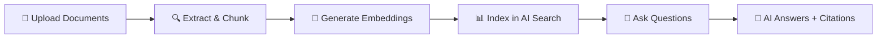
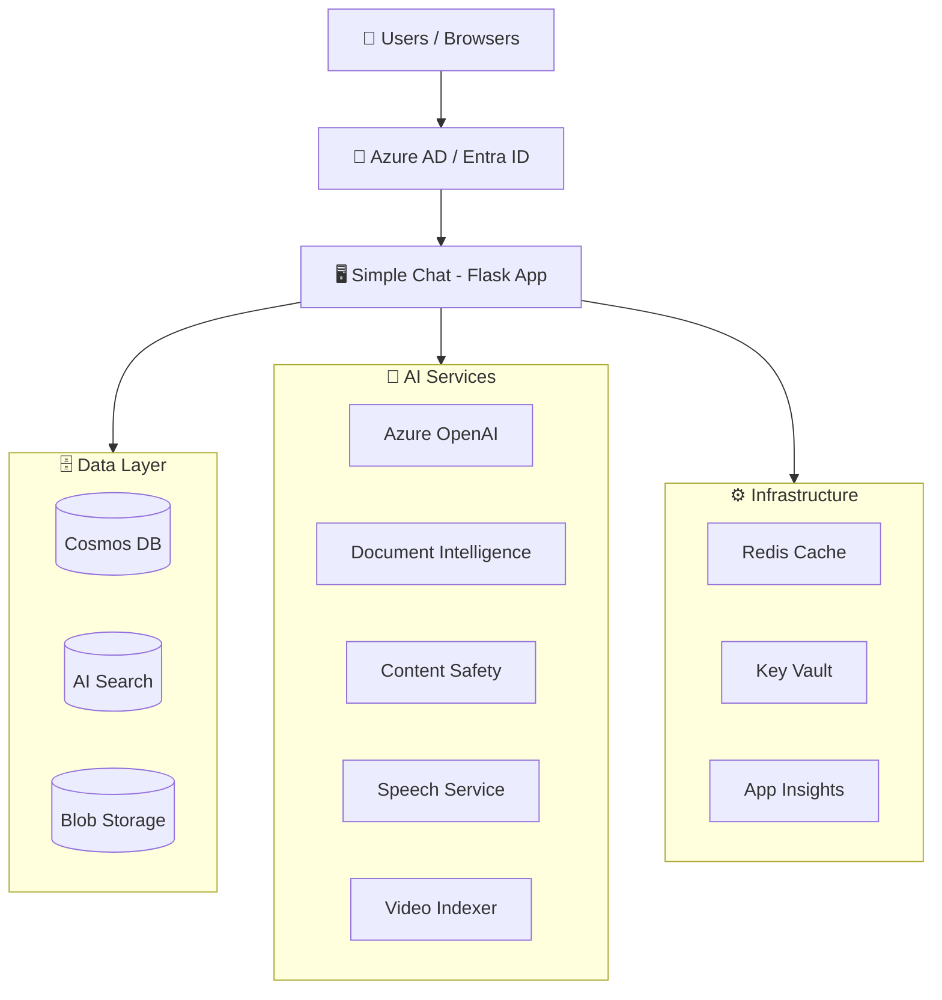

> **TL;DR** — An enterprise-ready, Azure-native web app for AI-powered document chat using Retrieval-Augmented Generation (RAG). Upload documents, ask questions, get AI answers grounded in your data — with full Azure AD security, multi-workspace collaboration, and 20+ optional features configurable from the Admin UI.

---

## 📑 Table of Contents

- [Overview](#-overview)
- [Features](#-features)
- [Architecture](#-architecture)
- [Tech Stack](#-tech-stack)
- [Getting Started](#-getting-started)
- [Quick Deploy](#-quick-deploy)
- [Documentation](#-documentation)
- [Development](#-development)
- [Contributing](#-contributing)
- [License](#-license)

---

## 📋 Overview

**Simple Chat** is a comprehensive, web-based platform for secure, context-aware interactions with generative AI models via **Azure OpenAI**. Its core capability is **Retrieval-Augmented Generation (RAG)** — users upload documents to personal, group, or public workspaces, and the AI grounds its responses in that data.



Documents are processed using **Azure AI Document Intelligence**, chunked intelligently, vectorized via **Azure OpenAI Embeddings**, and indexed into **Azure AI Search** for hybrid retrieval (semantic + keyword). The AI then generates responses grounded in your data with traceable citations.

---

## ✨ Features

### Core Capabilities

| Feature | Description |
|---------|-------------|
| **AI Chat** | Interact with GPT-4.1, GPT-4o, and other Azure OpenAI models |
| **RAG with Hybrid Search** | Vector + keyword search across your uploaded documents |
| **Document Management** | Upload, store, version, and manage documents across workspaces |
| **Multi-Workspace** | Personal, Group, and Public workspaces with RBAC |
| **Ephemeral Documents** | Temporary documents available only during the current chat session |
| **Authentication & RBAC** | Azure AD (Entra ID) with custom app roles (`Admin`, `User`, `CreateGroups`, etc.) |

### Optional Features (Admin-Configurable)

<details>
<summary><strong>Click to expand all optional features</strong></summary>

| Feature | Description |
|---------|-------------|
| **Content Safety** | Azure AI Content Safety moderation with custom block lists |
| **Image Generation** | DALL-E / GPT-Image models for on-demand image creation |
| **Video Processing** | Azure Video Indexer for transcript extraction, speaker ID, and timestamped search |
| **Audio Processing** | Azure Speech Service for audio transcription and voice interactions |
| **Speech-to-Text** | Voice input directly in the chat interface (up to 90 seconds) |
| **Text-to-Speech** | Natural voice responses powered by Azure Neural TTS |
| **Enhanced Citations** | Clickable source links with page numbers/timestamps, backed by Azure Storage |
| **Document Classification** | Custom classification labels and colors for document categorization |
| **Metadata Extraction** | AI-powered auto-tagging with keywords, summaries, and author inference |
| **Multi-Modal Vision** | GPT-4 Vision analysis for uploaded images alongside OCR |
| **Conversation Archiving** | Soft-delete with archival for compliance and audit |
| **User Feedback** | Thumbs up/down ratings with contextual comments |
| **Conversation Export** | Export chat histories for offline use |
| **File Sharing** | Share documents between users and workspaces |
| **Redis Cache** | Distributed session storage for horizontal scaling |
| **Agents & Plugins** | Semantic Kernel-powered agents with custom OpenAPI plugins |
| **API Documentation** | Built-in Swagger/OpenAPI interactive documentation |
| **Custom Branding** | Logo, title, favicon, and theme customization |
| **Classification Banner** | Security classification banner for data sensitivity |
| **Retention Policies** | Automatic cleanup of aged conversations and documents |

</details>

### Supported File Types

| Category | Formats |
|----------|---------|
| **Text** | `txt`, `md`, `html`, `json`, `xml`, `yaml`, `yml`, `log` |
| **Documents** | `pdf`, `doc`, `docm`, `docx`, `pptx`, `xlsx`, `xlsm`, `xls`, `csv` |
| **Images** | `jpg`, `jpeg`, `png`, `bmp`, `tiff`, `tif`, `heif`, `heic` |
| **Video** | `mp4`, `mov`, `avi`, `wmv`, `mkv`, `flv`, `webm`, `mpeg` + 18 more |
| **Audio** | `mp3`, `wav`, `ogg`, `aac`, `flac`, `m4a` |

---

## 🏗️ Architecture




> [!NOTE]
> For detailed architecture documentation, see [docs/explanation/architecture.md](./docs/explanation/architecture.md)

---

## 🔧 Tech Stack

| Category | Technology |
|----------|------------|
| **Language** | Python 3.12 |
| **Framework** | Flask 2.2.5 + Gunicorn |
| **Frontend** | Jinja2 Templates + Bootstrap 5 + Vanilla JS |
| **Database** | Azure Cosmos DB (NoSQL) |
| **Search** | Azure AI Search (Hybrid: Vector + Keyword) |
| **AI Models** | Azure OpenAI (GPT-4.1, GPT-4o, Embeddings, DALL-E) |
| **Auth** | Azure AD (Entra ID) via MSAL |
| **OCR** | Azure AI Document Intelligence |
| **Container** | Distroless Python 3.12 (non-root) |
| **IaC** | Azure Bicep + Terraform |

---

## 🚀 Getting Started

### Prerequisites

- Azure subscription with access to Azure OpenAI
- Azure AD tenant with app registration permissions
- Python 3.11+ (for local development)
- Azure CLI + Azure Developer CLI (`azd`)

### Local Development

```bash
# Clone the repository
git clone https://github.com/microsoft/simplechat.git
cd simplechat

# Install dependencies
cd application/single_app
pip install -r requirements.txt

# Configure environment
cp example.env .env
# Edit .env with your Azure service credentials

# Run the application
python app.py
```

The app starts on `http://localhost:5000`.

### Environment Variables

| Variable | Description |
|----------|-------------|
| `AZURE_COSMOS_ENDPOINT` | Cosmos DB account URI |
| `AZURE_COSMOS_KEY` | Cosmos DB primary key |
| `CLIENT_ID` | Azure AD app registration client ID |
| `TENANT_ID` | Azure AD tenant ID |
| `MICROSOFT_PROVIDER_AUTHENTICATION_SECRET` | App registration client secret |
| `SECRET_KEY` | Flask session signing key (32+ random chars) |
| `AZURE_ENVIRONMENT` | `public`, `usgovernment`, or `custom` |

> [!TIP]
> See [`application/single_app/example.env`](./application/single_app/example.env) for the complete list of environment variables.

---

## 📦 Quick Deploy

Three deployment options are available:

| Method | Path | Best For |
|--------|------|----------|
| **Azure Bicep** (recommended) | [`deployers/bicep/`](./deployers/bicep/README.md) | Azure Public & Government, full IaC |
| **Terraform** | [`deployers/terraform/`](./deployers/terraform/) | Azure Government optimized |
| **Docker** | [`application/single_app/Dockerfile`](./application/single_app/Dockerfile) | Local dev, custom hosting |

### Deploy with Azure Developer CLI

```powershell
# 1. Create Entra app registration
cd deployers
.\Initialize-EntraApplication.ps1 -AppName "<name>" -Environment "<env>" -AppRolesJsonPath "./azurecli/appRegistrationRoles.json"
```

> [!IMPORTANT]
> Save the output (Client ID, Tenant ID, Client Secret) — it won't be shown again.

```powershell
# 2. Configure AZD
azd config set cloud.name AzureCloud   # or AzureUSGovernment
azd auth login
azd env new <environment>
azd env select <environment>

# 3. Deploy everything
azd up
```

Post-deployment steps:

- [ ] Grant admin consent for API permissions in Azure Portal
- [ ] Assign users/groups to the Enterprise Application with app roles
- [ ] Store the client secret in Azure Key Vault
- [ ] Log in as Admin and configure features via Admin Settings UI

> [!NOTE]
> For the full deployment guide, see [`deployers/bicep/README.md`](./deployers/bicep/README.md)

---

## 📖 Documentation

| Document | Description |
|----------|-------------|
| [Full Documentation Site](https://microsoft.github.io/simplechat/) | Comprehensive online docs |
| [Architecture](./docs/explanation/architecture.md) | System architecture and design |
| [Admin Configuration](./docs/admin_configuration.md) | Admin Settings UI guide |
| [Application Workflows](./docs/application_workflows.md) | RAG ingestion and chat workflows |
| [Application Scaling](./docs/application_scaling.md) | Scaling strategies per service |
| [Design Principles](./docs/explanation/design_principles.md) | Core design decisions |
| [Feature Docs](./docs/explanation/features/) | Individual feature documentation |

---

## 🛠️ Development

### Project Structure

```
simplechat/
├── 📁 application/
│   ├── 📁 single_app/          # Main Flask application
│   │   ├── app.py              # Entry point
│   │   ├── config.py           # Configuration & feature flags
│   │   ├── route_*.py          # 40+ route modules
│   │   ├── functions_*.py      # 30+ business logic modules
│   │   ├── templates/          # Jinja2 HTML templates
│   │   ├── static/             # JS, CSS, images
│   │   ├── Dockerfile          # Multi-stage distroless build
│   │   └── requirements.txt    # Python dependencies
│   ├── 📁 external_apps/       # Bulk loader, database seeder
│   └── 📁 community_customizations/
├── 📁 deployers/
│   ├── 📁 bicep/               # Azure Bicep IaC (20+ modules)
│   └── 📁 terraform/           # Terraform IaC
├── 📁 docs/                    # Documentation
├── 📁 functional_tests/        # Test suites
└── 📄 CLAUDE.md                # AI assistant instructions
```

### Running Tests

```bash
cd functional_tests
python test_<feature_area>.py
```

---

## 🤝 Contributing

See [CONTRIBUTING.md](CONTRIBUTING.md) for guidelines.

This project has adopted the [Microsoft Open Source Code of Conduct](https://opensource.microsoft.com/codeofconduct/).

---

## 📄 License

This project is licensed under the MIT License — see [LICENSE](LICENSE) for details.

---

<p align="center">
  Built with Azure AI Services
  <br>
  <a href="https://microsoft.github.io/simplechat/">Documentation</a> · <a href="https://github.com/microsoft/simplechat/issues">Issues</a> · <a href="./docs/explanation/features/">Features</a>
</p>
