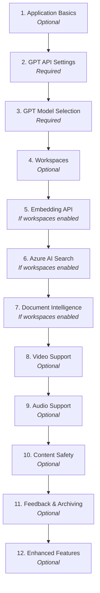

# Simple Chat - Admin Configuration

[Return to Main](../README.md)

---

## Table of Contents

- [Overview](#overview)
- [Setup Walkthrough](#-setup-walkthrough)
- [Configuration Sections](#%EF%B8%8F-configuration-sections)
- [Navigation Options](#-navigation-options)
- [Tips for Configuration](#-tips-for-configuration)

---

> **TL;DR:** The Admin Settings page is a centralized UI for configuring all SimpleChat features and service connections. It includes an interactive Setup Walkthrough for first-time configuration, nine tabbed sections covering AI models, workspaces, search, safety, agents, scaling, and logging. Use "Test Connection" buttons to validate services before saving. Managed Identity and APIM are supported across all Azure service integrations.

---

## 📋 Overview

Once the application is running and you log in as a user assigned the Admin role, you can access the **Admin Settings** page. This UI provides a centralized location to configure most application features and service connections.

---

## 🚶 Setup Walkthrough

The Admin Settings page includes an interactive **Setup Walkthrough** feature that guides you through the initial configuration process. This is particularly helpful for first-time setup.

### 🚀 Starting the Walkthrough

- The walkthrough automatically appears on first-time setup when critical settings are missing
- You can manually launch it anytime by clicking the **"Start Setup Walkthrough"** button at the top of the Admin Settings page
- The walkthrough will automatically navigate to the relevant configuration tabs as you progress through each step

### ✨ Walkthrough Features

| Feature | Description |
|---------|-------------|
| **Automatic Tab Navigation** | As you move through steps, the walkthrough automatically switches to the relevant admin settings tab and scrolls to the appropriate section |
| **Smart Step Skipping** | Steps that aren't applicable based on your configuration choices (e.g., workspace-dependent features) are automatically skipped |
| **Real-time Validation** | The "Next" button becomes available only when required fields for the current step are completed |
| **Progress Tracking** | Visual progress bar shows your completion status through the setup process |
| **Flexible Navigation** | Use "Previous" and "Next" buttons to move between steps, or close the walkthrough at any time to configure settings manually |

### 🧭 Walkthrough Steps Overview

The walkthrough covers these key configuration areas in order:

| Step | Area | Requirement |
|------|------|-------------|
| 1 | Application Basics | Optional |
| 2 | GPT API Settings | Required |
| 3 | GPT Model Selection | Required |
| 4 | Workspaces | Optional |
| 5 | Embedding API | Required if workspaces enabled |
| 6 | Azure AI Search | Required if workspaces enabled |
| 7 | Document Intelligence | Required if workspaces enabled |
| 8 | Video Support | Optional, workspace-dependent |
| 9 | Audio Support | Optional, workspace-dependent |
| 10 | Content Safety | Optional |
| 11 | User Feedback & Archiving | Optional |
| 12 | Enhanced Features | Optional |

> [!NOTE]
> The walkthrough automatically adjusts which steps are required based on your selections. For example, if you don't enable workspaces, embedding and search configuration steps become optional.

---

## ⚙️ Configuration Sections

Key configuration sections include:

### 1. General

| Setting | Description |
|---------|-------------|
| **Branding** | Application title, custom logo upload (light and dark mode), favicon |
| **Home Page Text** | Landing page markdown content with alignment options and optional editor |
| **Appearance** | Default theme (light/dark mode) and navigation layout (top nav or left sidebar) |
| **Health Check** | External health check endpoint configuration for monitoring systems |
| **API Documentation** | Enable/disable Swagger/OpenAPI documentation endpoint |
| **Classification Banner** | Security classification banner for data sensitivity indication |
| **External Links** | Custom navigation links to external resources with configurable menu behavior |
| **System Settings** | Maximum file size, conversation history limit, default system prompt |

### 2. AI Models

- **GPT Configuration**:
  - Configure Azure OpenAI endpoint(s) for chat models
  - Supports Direct endpoint or APIM (API Management)
  - Allows Key or Managed Identity authentication
  - Test connection button
  - Select multiple active deployment(s) - users can choose from available models
  - Multi-model selection for users

- **Embeddings Configuration**:
  - Configure Azure OpenAI endpoint(s) for embedding models
  - Supports Direct/APIM, Key/Managed Identity
  - Test connection
  - Select active deployment

- **Image Generation** *(Optional)*:
  - Enable/disable feature
  - Configure Azure OpenAI DALL-E endpoint
  - Supports Direct/APIM, Key/Managed Identity
  - Test connection
  - Select active deployment

### 3. Workspaces

| Setting | Description |
|---------|-------------|
| **Personal Workspaces** | Enable/disable "Your Workspace" (personal docs) |
| **Group Workspaces** | Enable/disable "Groups" (group docs); option to enforce `CreateGroups` RBAC role for creating new groups |
| **Public Workspaces** | Enable/disable "Public" (public docs); option to enforce `CreatePublicWorkspaces` RBAC role for creating new public workspaces |
| **File Sharing** | Enable/disable file sharing capabilities between users and workspaces |
| **Metadata Extraction** | Enable/disable metadata extraction from documents; select the GPT model used for extraction |
| **Multi-Modal Vision Analysis** | Enable vision-capable models for image analysis in addition to document OCR; automatic filtering of compatible GPT models (GPT-4o, GPT-4 Vision, etc.) |
| **Document Classification** | Enable/disable classification features; define custom classification labels and colors; dynamic category management with inline editing |

### 4. Citations

| Mode | Description |
|------|-------------|
| **Standard Citations** | Basic text references (always enabled) |
| **Enhanced Citations** | Enable/disable enhanced citation features; configure Azure Storage Account Connection String or Service Endpoint with Managed Identity; store original files for direct reference and preview |

### 5. Safety

| Setting | Description |
|---------|-------------|
| **Content Safety** | Enable/disable content filtering; configure endpoint (Direct/APIM); Key/Managed Identity authentication; test connection |
| **User Feedback** | Enable/disable thumbs up/down feedback on AI responses |
| **Admin Access RBAC** | Option to require `SafetyViolationAdmin` role for safety violation admin views; option to require `FeedbackAdmin` role for feedback admin views |
| **Conversation Archiving** | Enable/disable conversation archiving instead of permanent deletion |

### 6. Search & Extract

- **Azure AI Search**:
  - Configure connection (Endpoint, Key/Managed Identity)
  - Support for Direct or APIM routing
  - Test connection

- **Document Intelligence**:
  - Configure connection (Endpoint, Key/Managed Identity)
  - Support for Direct or APIM routing
  - Test connection

- **Multimedia Support** (Video/Audio uploads):

  | Media Type | Configuration |
  |------------|---------------|
  | **Video Files** | Configure Azure Video Indexer using Managed Identity authentication: Resource Group, Subscription ID, Account Name, Location, Account ID, API Endpoint, ARM API Version, Timeout |
  | **Audio Files** | Configure Speech Service: Endpoint, Location/Region, Locale, Key/Managed Identity authentication |

### 7. Agents

- **Agents Configuration**:
  - Enable/disable Semantic Kernel-powered agents
  - Configure workspace mode (per-user vs global agents)
  - Agent orchestration settings (single agent vs multi-agent group chat)
  - Manage global agents and select default/orchestrator agent

- **Actions Configuration**:
  - Enable/disable core plugins (Time, HTTP, Wait, Math, Text, Fact Memory, Embedding)
  - Configure user and group plugin permissions
  - Manage custom OpenAPI plugins

### 8. Scale

| Setting | Description |
|---------|-------------|
| **Redis Cache** | Enable distributed session storage for horizontal scaling; configure Redis endpoint and authentication (Key or Managed Identity); test connection |
| **Front Door** | Enable Azure Front Door integration; configure Front Door URL for authentication flows; supports global load balancing and custom domains |

### 9. Logging

| Setting | Description |
|---------|-------------|
| **Application Insights Logging** | Enable global logging for agents and orchestration; requires application restart to take effect |
| **Debug Logging** | Enable/disable debug print statements; optional time-based auto-disable feature |
| **File Processing Logs** | Enable logging of file processing events; logs stored in Cosmos DB file_processing container; optional time-based auto-disable feature |

> [!WARNING]
> Debug Logging collects tokens and keys during debug sessions. Use the time-based auto-disable feature to prevent accidental long-running debug sessions in production.

---

## 🧭 Navigation Options

The Admin Settings page supports two navigation layouts:

| Layout | Description |
|--------|-------------|
| **Tab Navigation** (Default) | Horizontal tabs at the top for switching between configuration sections |
| **Left Sidebar Navigation** | Collapsible left sidebar with grouped navigation items; can be set as the default for all users in General > Appearance settings; users can toggle between layouts individually |

> [!TIP]
> The Setup Walkthrough works seamlessly with both navigation styles.

---

## 💡 Tips for Configuration

| Tip | Details |
|-----|---------|
| **Save Changes** | The floating "Save Settings" button in the bottom-right becomes active (blue) when you make changes |
| **Test Connections** | Use the "Test Connection" buttons to verify your service configurations before saving |
| **APIM vs Direct** | When using Azure API Management (APIM), you'll need to manually specify model names as automatic model fetching is not available |
| **Dependencies** | The walkthrough will alert you if required services aren't configured when you enable dependent features (e.g., workspaces require embeddings, AI Search, and Document Intelligence) |
| **Required vs Optional** | The walkthrough clearly indicates which settings are required vs optional based on your configuration choices |

> [!NOTE]
> **Managed Identity**: When using Managed Identity authentication, ensure your Service Principal has the appropriate roles assigned:
>
> | Service | Required Role |
> |---------|---------------|
> | **Azure OpenAI** | Cognitive Services OpenAI User |
> | **Speech Service** | Cognitive Services Speech Contributor (requires custom domain name on endpoint) |
> | **Video Indexer** | Appropriate Video Indexer roles for your account |
