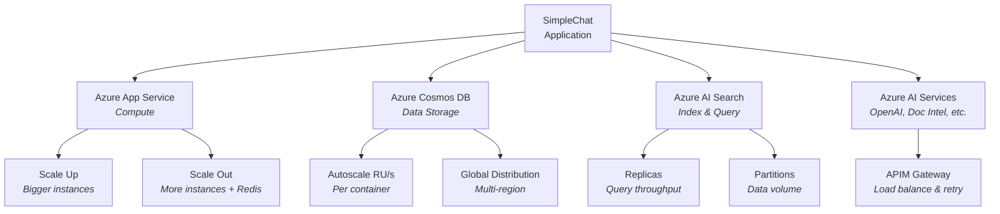
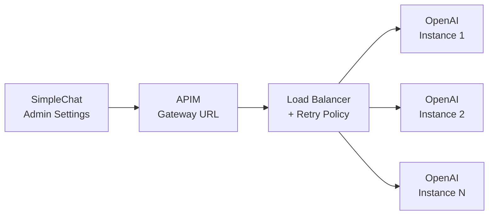

# Simple Chat - Application Scaling

[Return to Main](../README.md)

---

## Table of Contents

- [Overview](#-overview)
- [Azure App Service](#-azure-app-service)
- [Azure Cosmos DB](#%EF%B8%8F-azure-cosmos-db)
- [Azure AI Search](#-azure-ai-search)
- [Azure AI / Cognitive Services](#-azure-ai--cognitive-services-openai-document-intelligence-etc)

---

> **TL;DR:** Scale SimpleChat by monitoring Azure metrics and adjusting resources as demand grows. App Service supports vertical (scale up tiers) and horizontal (scale out with Redis sessions) scaling. Cosmos DB uses autoscale RU/s per container. AI Search scales via replicas (query throughput) and partitions (data volume). For Azure AI services, use APIM as a gateway for load balancing, retry policies, and centralized rate limiting across all endpoints.

---

## 📋 Overview

> [!NOTE]
> **General Scaling Principle:** Monitor key performance metrics (CPU/memory utilization, request latency, queue lengths, RU consumption, query latency, rate limit responses) for all services using **Azure Monitor** and **Application Insights**. Use these metrics to make informed decisions about when and how to scale each component.

As user load, data volume, or feature usage increases, you will need to scale the underlying Azure resources to maintain performance and availability. Here's a breakdown of scaling strategies for the key components:

---

## ⚡ Azure App Service

<a href="#simple-chat---application-scaling" style="text-decoration: none;">Return to top</a>

The App Service hosts the Python backend application.

### Vertical Scaling (Scale Up)

| Aspect | Details |
|--------|---------|
| **What** | Increasing the resources (CPU, RAM, Storage) allocated to each instance running your application |
| **How** | Change the App Service Plan pricing tier (e.g., move from P0v3 to P1v3, P2v3, etc.) |
| **When** | Useful if individual requests are resource-intensive or if a single instance needs more power to handle its share of the load |
| **SimpleChat Support** | **Supported.** The application benefits directly from more powerful instances |

### Horizontal Scaling (Scale Out)

| Aspect | Details |
|--------|---------|
| **What** | Increasing the number of instances running your application. Traffic is load-balanced across these instances |
| **How** | Adjust the "Instance count" slider in the App Service Plan's "Scale out (App Service plan)" settings, or configure Autoscale rules based on metrics (CPU percentage, memory usage, request queue length) |
| **When** | Essential for handling higher numbers of concurrent users and improving availability |
| **SimpleChat Support** | **Fully Supported** |

> [!IMPORTANT]
> With the integration of **Azure Cache for Redis** as a distributed session backend, Simple Chat now supports true horizontal scaling. User sessions are no longer tied to a single app instance, allowing seamless load balancing and high availability across multiple instances.

> [!TIP]
> **Best Practice:** Enable Redis Cache and configure the application to use it for session storage before scaling out. This ensures consistent user experience and prevents authentication issues. See [Setup Instructions](#setup-instructions) for details on deploying and configuring Azure Cache for Redis.

---

## 🗄️ Azure Cosmos DB

<a href="#simple-chat---application-scaling" style="text-decoration: none;">Return to top</a>

Cosmos DB stores metadata, conversations, settings, etc. Scaling focuses on Request Units per second (RU/s) and global distribution.

### ⚙️ Throughput Scaling (RU/s)

**Autoscale** is the recommended approach. You set a *maximum* RU/s value, and Cosmos DB automatically scales the provisioned throughput between 10% and 100% of that maximum based on real-time usage. This helps manage costs while ensuring performance.

You can set Autoscale throughput at the database level (shared by all containers) or, preferably, at the **individual container level**.

**Recommendations:**

1. Set **Max throughput** at the database level initially (e.g., 1000 RU/s) during setup.
2. **Configure Container-Level Autoscale (Post-Setup):** For optimal performance, set maximum Autoscale RU/s per container:

| Container | Max RU/s | Autoscale Range |
|-----------|----------|-----------------|
| `messages` | 4000 RU/s | 400 - 4000 RU/s |
| `documents` | 4000 RU/s | 400 - 4000 RU/s |
| `group_documents` | 4000 RU/s | 400 - 4000 RU/s |
| `settings`, `feedback`, `archived_conversations`, etc. | 1000 RU/s | 100 - 1000 RU/s |

> [!WARNING]
> Continuously monitor RU consumption (using Azure Monitor Metrics) for each container and adjust the maximum Autoscale values as needed to avoid throttling (HTTP 429 errors) while optimizing cost.

### 🌐 Global Distribution

| Aspect | Details |
|--------|---------|
| **What** | Replicate your Cosmos DB data across multiple Azure regions |
| **Why** | Reduces read/write latency for users in different geographic locations and provides higher availability via regional failover |
| **How** | Configure replication in the Azure Cosmos DB portal ("Replicate data globally"). The application *should* automatically connect to the nearest available region, but thorough testing in a multi-region setup is advised |

> [!NOTE]
> Consider the implications for data consistency levels based on your application's requirements when configuring multi-region replication.

---

## 🔍 Azure AI Search

<a href="#simple-chat---application-scaling" style="text-decoration: none;">Return to top</a>

Azure AI Search scaling involves adjusting replicas, partitions, and the service tier.

### Replicas (Horizontal Query Scaling)

| Aspect | Details |
|--------|---------|
| **What** | Copies of your index that handle query requests in parallel |
| **Why** | Increase query throughput (Queries Per Second - QPS) and improve high availability (queries can be served even if one replica is down) |
| **How** | Increase the "Replica count" on the AI Search service's "Scale" blade in the Azure portal |
| **Guidance** | Start with 1 for Dev/Test, consider 2-3 for basic HA in production, and increase based on monitored query latency and QPS under load |

### Partitions (Data & Indexing Scaling)

| Aspect | Details |
|--------|---------|
| **What** | Shards that store distinct portions of your index. More partitions distribute the index storage and allow for faster parallel indexing |
| **Why** | Increase the total amount of data the index can hold and potentially speed up document ingestion/indexing |
| **How** | Increase the "Partition count" on the "Scale" blade |

> [!WARNING]
> You generally need to decide on the partition count based on anticipated data volume *before* significant data is indexed, as changing partitions often requires re-indexing. The S1 tier supports up to 12 partitions.

### ⚡ Service Tier (Vertical Scaling)

| Aspect | Details |
|--------|---------|
| **What** | Changing the overall service tier (e.g., Basic, S1, S2, S3, L1, L2) |
| **Why** | Higher tiers offer increased limits on storage per partition, total storage, maximum replicas/partitions, Semantic Ranker usage, and other features |
| **How** | Select a different pricing tier on the "Scale" blade |
| **Guidance** | The recommended starting point is S1. Scale up to S2/S3/L-tiers if you hit the fundamental limits of S1 or require features only available in higher tiers |

---

## 🌐 Azure AI / Cognitive Services (OpenAI, Document Intelligence, etc.)

<a href="#simple-chat---application-scaling" style="text-decoration: none;">Return to top</a>

Services like Azure OpenAI, Document Intelligence, Content Safety, Speech Service, and Video Indexer are typically consumed via API calls and often have rate limits (e.g., Tokens Per Minute/Requests Per Minute for OpenAI, Transactions Per Second for others).

### ⚙️ Rate Limits & Quotas

Be aware of the default limits for your service tiers and regions. Monitor usage and request quota increases via Azure support if necessary.

### 🏗️ Azure API Management (APIM) - Recommended Pattern

| Aspect | Details |
|--------|---------|
| **What** | An Azure service that acts as a gateway or facade for your backend APIs, including Azure AI services |
| **Why** | Load balancing across multiple deployments, custom throttling/rate limiting, automatic retry policies for transient errors (HTTP 429), and centralized management for security, monitoring, and policy enforcement |

**How to set up:**

1.  Deploy an Azure API Management instance.
2.  Configure APIM to route requests to your specific Azure AI service endpoints. Implement policies for load balancing, retries, rate limiting, etc.
3.  **Reference:** For detailed patterns, especially for Azure OpenAI, refer to the guidance and examples provided in the **[AzureOpenAI-with-APIM GitHub repository](https://github.com/microsoft/AzureOpenAI-with-APIM)**. This repository demonstrates robust methods for load balancing and scaling Azure OpenAI consumption.
4.  **Simple Chat Integration:** Configure the **Admin Settings** within Simple Chat to point to your **APIM Gateway URL** and use your **APIM Subscription Key** for authentication, instead of directly using the backend service endpoint and key.

> [!TIP]
> The Admin Settings UI supports APIM configuration for Azure OpenAI (GPT, Embeddings, Image Gen), Content Safety, Document Intelligence, and AI Search -- giving you a single pane of glass for all service routing.
