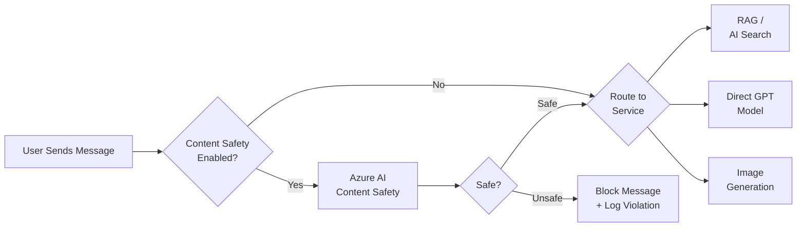
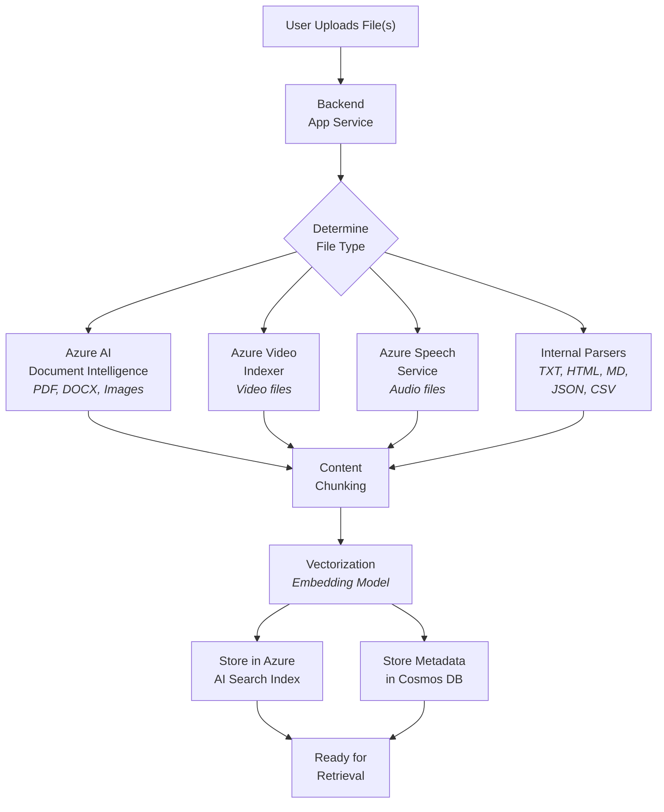

# Simple Chat - Application Workflows

[Return to Main](../README.md)

---

## Table of Contents

- [Content Safety - Workflow](#-content-safety---workflow)
- [Add Your Data (RAG Ingestion)](#-add-your-data-rag-ingestion)

---

## 🛡️ Content Safety - Workflow

1.  **User Sends Message**: A user types a message in the chat interface.
2.  **Content Safety Interrogation (If Enabled)**:
    *   Before the message reaches *any* backend service (AI model, Search, Image Gen, etc.), it is sent to the configured **Azure AI Content Safety** endpoint.
    *   Content Safety analyzes the text for harmful content based on configured categories (Hate, Sexual, Violence, Self-Harm) and severity thresholds.
    *   Custom blocklists can also be applied.
3.  **Decision Point**:
    *   **If Safe**: The message proceeds to the intended service (e.g., RAG, Direct Model Interaction, Image Generation).
    *   **If Unsafe**: The message is blocked. The user receives a generic notification (or configured message). Details of the violation may be logged (if configured) and potentially viewable by users with the `SafetyAdmin` role.
4.  **Service Interaction (If Safe)**:
    *   **RAG / AI Search**: The query is used to search Azure AI Search indexes (personal/group).
    *   **Direct Model Interaction**: The message is sent directly to the Azure OpenAI GPT model.
    *   **Image Generation**: The prompt is sent to the Azure OpenAI DALL-E model (if enabled).

> [!NOTE]
> Responses from downstream services are typically *not* sent back through Content Safety by default in this flow, though Azure OpenAI itself has built-in content filtering.

---

## 📂 Add Your Data (RAG Ingestion)

This workflow describes how documents uploaded via "Your Workspace" or "Group Workspaces" are processed for Retrieval-Augmented Generation.

### 🚀 Step-by-Step Process

1.  **User Uploads File(s)**:
    *   User selects one or more supported files via the application UI (e.g., PDF, DOCX, TXT, MP4, MP3).
    *   Files are sent to the backend application running on Azure App Service.

2.  **Initial Processing & Text Extraction**:
    *   The backend determines the file type.
    *   The file is sent to the appropriate service for text extraction:

    | File Type | Service | Extracts |
    |-----------|---------|----------|
    | PDFs, Office Docs, Images | **Azure AI Document Intelligence** | Text, layout, tables (OCR) |
    | Video files | **Azure Video Indexer** | Audio transcript and frame OCR text |
    | Audio files | **Azure Speech Service** | Audio transcript |
    | Plain text, HTML, MD, JSON, CSV | **Internal Parsers** | Raw text content |

3.  **Content Chunking**:
    *   The extracted text content is divided into smaller, manageable chunks based on file type and content structure.
    *   Chunking strategies vary (see [Advanced Chunking Logic](#advanced-chunking-logic) under Latest Features) but aim for semantic coherence and appropriate size (~400-1200 words, depending on type), often with overlap between chunks to preserve context. Timestamps or page numbers are included where applicable.

4.  **Vectorization (Embedding)**:
    *   Each text chunk is sent to the configured **Embedding Model** endpoint in **Azure OpenAI**.
    *   The model generates a high-dimensional **vector embedding** (a numerical representation) for the semantic content of the chunk.
    *   This process repeats for all chunks from the uploaded file(s).

5.  **Storage in Azure AI Search and Cosmos DB**:

    | Destination | Data Stored |
    |-------------|-------------|
    | **Azure AI Search Index** (`simplechat-user-index` or `simplechat-group-index`) | Chunk content (text), vector embedding, metadata (parent document ID, user/group ID, filename, chunk sequence number, page number, timestamp, classification tags, keywords/summary) |
    | **Azure Cosmos DB** | Parent document metadata (original filename, total chunks, upload date, user ID, group ID, document version, classification, processing status) |

    > [!TIP]
    > Cosmos DB maintains the relationship between the parent document record and its constituent chunks stored in Azure AI Search.

6.  **Ready for Retrieval**:
    *   Once indexed, the document content is available for hybrid search (vector + keyword) when users toggle "Search Your Data" or perform targeted searches within workspaces.
