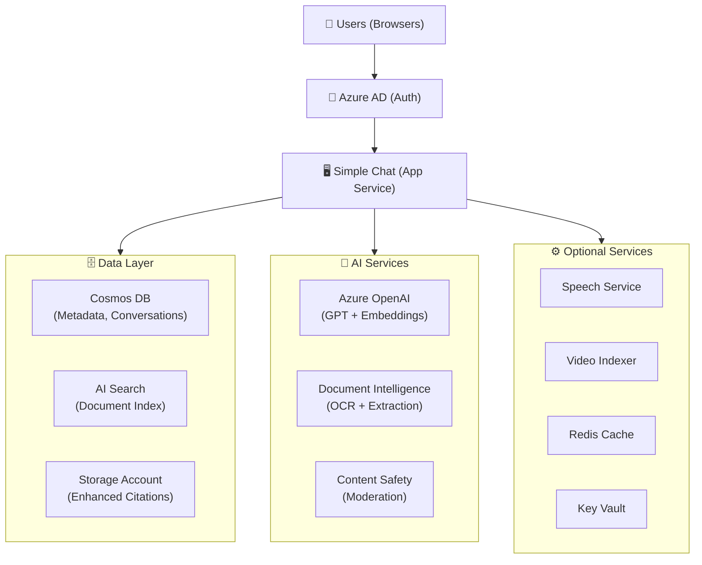
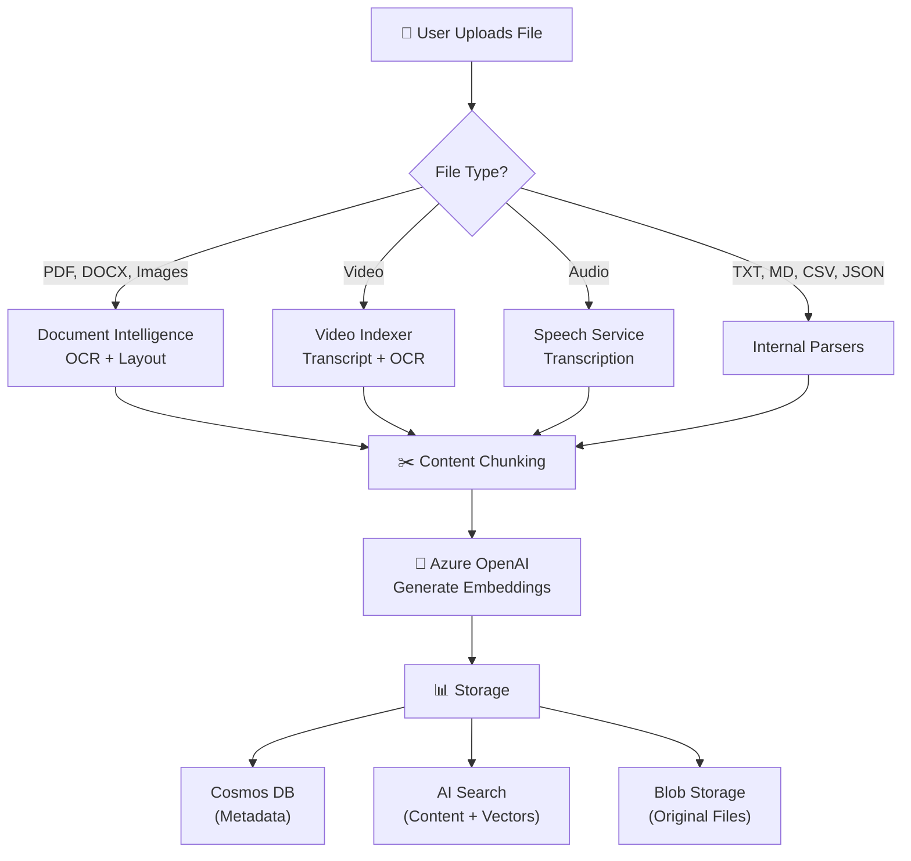
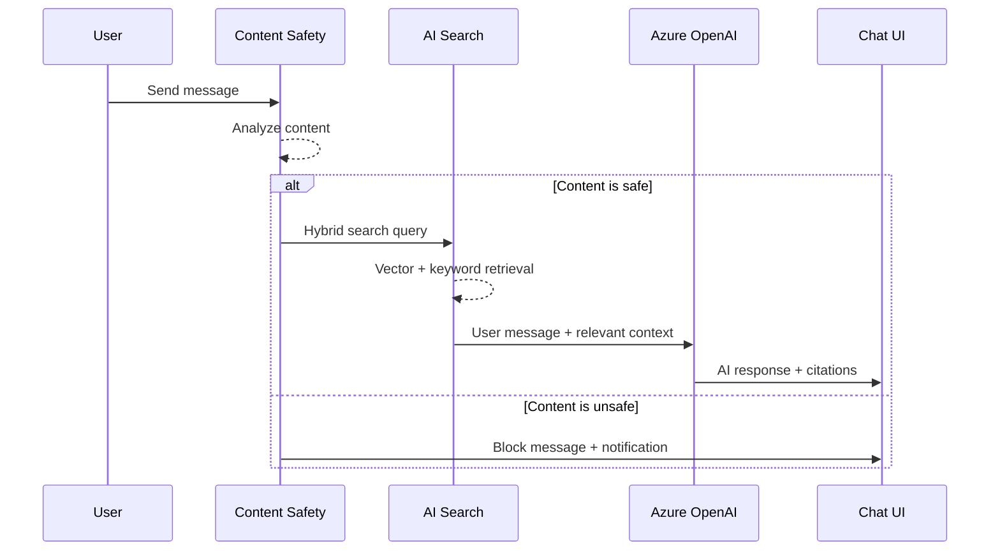
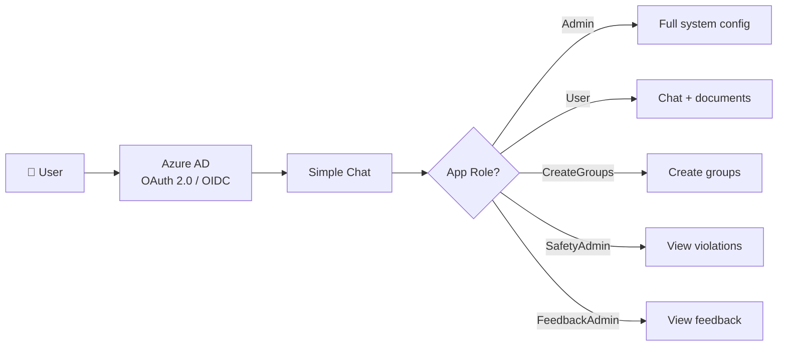
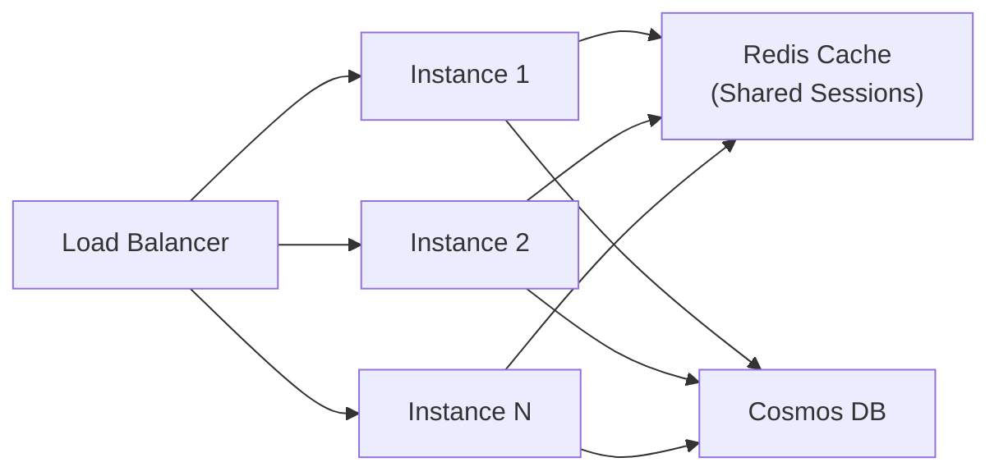

# Architecture

---
layout: libdoc/page
title: Architecture
order: 110
category: Explanation
---

[Home](../../README.md) > [Docs](../README.md) > **Architecture**

> **TL;DR** — Simple Chat is a Flask-based, Azure-native RAG application. Users upload documents, which are extracted, chunked, embedded, and indexed. The AI generates responses grounded in user data via hybrid search, with enterprise security via Azure AD and 20+ optional features toggled from the Admin UI.

---

## 📑 Table of Contents

- [System Overview](#-system-overview)
- [High-Level Architecture](#-high-level-architecture)
- [Core Components](#-core-components)
- [Data Flow and Processing](#-data-flow-and-processing)
- [Security Architecture](#-security-architecture)
- [Scalability Architecture](#-scalability-architecture)
- [Integration Architecture](#-integration-architecture)
- [Deployment Architectures](#-deployment-architectures)
- [Design Patterns](#-design-patterns-and-best-practices)
- [Technology Choices](#-technology-choices-and-rationale)

---

## 📋 System Overview

Simple Chat is built as a modern, cloud-native application leveraging Azure's AI and data services to provide Retrieval-Augmented Generation (RAG) capabilities with enterprise-grade security and scalability.

### Core Principles

| Principle | Details |
|-----------|---------|
| **Security-First** | Azure AD authentication, RBAC authorization, Managed Identity, private networking |
| **Scalable** | Stateless design, Redis session externalization, horizontal scaling, autoscaling |
| **Extensible** | Modular features, admin-configurable toggles, plugin architecture, API-first design |

---

## 🏗️ High-Level Architecture

---

## 🔌 Core Components

### Application Tier

**Azure App Service / Container App**

| Property | Details |
|----------|---------|
| **Purpose** | Hosts the Python web application |
| **Technology** | Flask 2.2.5 + Gunicorn |
| **Scaling** | Horizontal with session state externalization |
| **Security** | Azure AD integrated, Managed Identity support |

**Key Responsibilities:**
- User interface rendering and interaction handling
- Business logic orchestration
- API endpoint management (40+ route modules)
- Authentication and authorization enforcement
- Integration with Azure AI services

---

### 🗄️ Data Layer

#### Azure Cosmos DB

| Property | Details |
|----------|---------|
| **Purpose** | Primary data store for application metadata |
| **Data Model** | Document-based JSON storage (26 containers) |
| **Scaling** | Request Unit (RU) based autoscaling |
| **Consistency** | Session consistency for user interactions |

**Stored Data:**
- Conversation history and messages
- Document metadata and processing status
- User preferences and group memberships
- Application configuration settings
- Feedback, audit logs, and safety violations

#### Azure AI Search

| Property | Details |
|----------|---------|
| **Purpose** | Document content indexing and retrieval |
| **Technology** | Hybrid search (vector + keyword) |
| **Indexes** | `simplechat-user-index`, `simplechat-group-index`, `simplechat-public-index` |
| **Features** | Semantic search, custom ranking, faceted filtering |

#### Azure Storage Account

| Property | Details |
|----------|---------|
| **Purpose** | Stores processed document files for direct access (Enhanced Citations) |
| **Organization** | User-scoped and document-scoped blob containers |
| **Access** | Private with time-limited SAS tokens |

---

### 🤖 AI Services Layer

| Service | Purpose | Capabilities |
|---------|---------|-------------|
| **Azure OpenAI** | Conversational AI + Embeddings | GPT-4.1, GPT-4o, text-embedding-3, DALL-E / GPT-Image |
| **Document Intelligence** | Text extraction from documents | OCR, layout analysis, table extraction |
| **Content Safety** | Content moderation | Hate, sexual, violence, self-harm detection + custom block lists |
| **Speech Service** | Audio transcription + voice | Speech-to-text, text-to-speech |
| **Video Indexer** | Video content analysis | Transcript extraction, speaker ID, OCR on frames |

---

## 🔄 Data Flow and Processing

### Document Ingestion Workflow

### Chat Processing Workflow

---

## 🔒 Security Architecture

### Authentication & Authorization

### Data Access Control

| Scope | Isolation |
|-------|-----------|
| **Personal Workspaces** | User-scoped — only the owner can access |
| **Group Workspaces** | Role-based group membership (Owner, Admin, Member) |
| **Public Workspaces** | Visible to all authenticated users |
| **Search Isolation** | Separate indexes per workspace type |

### Network Security

| Layer | Technology |
|-------|-----------|
| **Authentication** | Azure AD (Entra ID) via MSAL |
| **Service Auth** | Managed Identity (eliminates stored secrets) |
| **Secrets** | Azure Key Vault |
| **Encryption** | TLS in transit, Azure-native at rest |
| **Private Networking** | VNet integration, Private Endpoints, NSGs, Private DNS |

---

## ⚡ Scalability Architecture

### Horizontal Scaling Design

| Component | Scaling Strategy |
|-----------|-----------------|
| **App Service** | Horizontal (add instances) + Vertical (increase tier) |
| **Cosmos DB** | Autoscale RU/s per container + global distribution |
| **AI Search** | Replicas (query throughput) + Partitions (storage) |
| **Redis Cache** | Memory and connection scaling |
| **Azure OpenAI** | Multiple deployments + APIM load balancing |

### Performance Optimization

| Strategy | Implementation |
|----------|---------------|
| **Session Cache** | Redis for distributed session storage |
| **Search Cache** | AI Search query result caching |
| **Settings Cache** | In-memory with Redis fallback |
| **Static Assets** | Browser caching headers |
| **DB Optimization** | Partition strategy, connection pooling, minimized RU consumption |

---

## 🔌 Integration Architecture

### Extensibility Points

| Integration | Description |
|-------------|-------------|
| **Custom AI Models** | Bring your own model endpoints via APIM |
| **OpenAPI Plugins** | Custom tool integrations via Semantic Kernel |
| **Agents** | Configurable AI agents with multi-agent orchestration |
| **APIM Gateway** | Centralized API management for all AI services |
| **REST APIs** | Standard HTTP/JSON with Bearer token + Managed Identity auth |

### 📊 Monitoring and Observability

| Component | Purpose |
|-----------|---------|
| **Application Insights** | Request tracing, error tracking, custom telemetry |
| **Azure Monitor** | Resource health, cost monitoring, alerting |
| **Activity Logging** | Audit trail in Cosmos DB for all user actions |
| **Debug Logging** | Configurable verbose logging with auto-disable timer |

---

## 📦 Deployment Architectures

### Single-Region Deployment (Recommended)

> [!TIP]
> Single-region is suitable for most enterprise deployments — lower latency, simpler networking, easier data residency compliance.

All services deployed in one Azure region with optional VNet integration and private endpoints.

### Multi-Region Deployment

> [!WARNING]
> Multi-region adds complexity — consider data synchronization, consistency, cross-region latency, and data sovereignty requirements.

Primary and secondary region deployments with Cosmos DB global distribution, Traffic Manager routing, and regional failover.

### Supported Cloud Environments

| Environment | Support |
|-------------|---------|
| **Azure Commercial (Public)** | Full support |
| **Azure Government** | Full support (optimized Terraform) |
| **Custom Cloud** | Configurable endpoints |

---

## 🏗️ Design Patterns and Best Practices

### Service Separation

| Service Area | Responsibility |
|-------------|----------------|
| **Document Processing** | Independent ingestion pipeline |
| **Search & Retrieval** | Dedicated search and hybrid retrieval |
| **Chat & AI** | Conversation management and AI orchestration |
| **Admin & Config** | Configuration and management APIs |

### Communication Patterns

| Pattern | Usage |
|---------|-------|
| **Async Processing** | Document ingestion, video/audio processing |
| **Event-Driven** | File processing status updates |
| **Circuit Breakers** | Fault tolerance for external AI services |
| **Retry Logic** | Resilient service interactions with backoff |

### Data Consistency

| Type | Where Applied |
|------|---------------|
| **Eventually Consistent** | Document processing → search indexing, cross-service sync |
| **Strongly Consistent** | Authentication, configuration changes, critical operations |

---

## 💡 Technology Choices and Rationale

| Choice | Rationale |
|--------|-----------|
| **Azure OpenAI** | Enterprise-grade AI with Azure security, private deployments, compliance |
| **Cosmos DB** | Flexible schema, global distribution, built-in scaling, session consistency |
| **AI Search** | Hybrid search (vector + keyword), semantic ranking, Azure integration |
| **Python/Flask** | Rich AI/ML ecosystem, strong Azure SDK support, rapid development |
| **Jinja2/Bootstrap 5** | Server-rendered templates, minimal frontend complexity, responsive design |
| **Distroless Container** | Minimal attack surface, non-root execution, production-hardened |

---

> This architecture provides a solid foundation for understanding how Simple Chat components work together to deliver secure, scalable, and intelligent conversational AI capabilities.

---

[Home](../../README.md) > [Docs](../README.md) > **Architecture**
